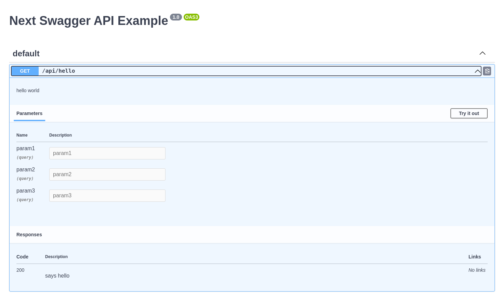
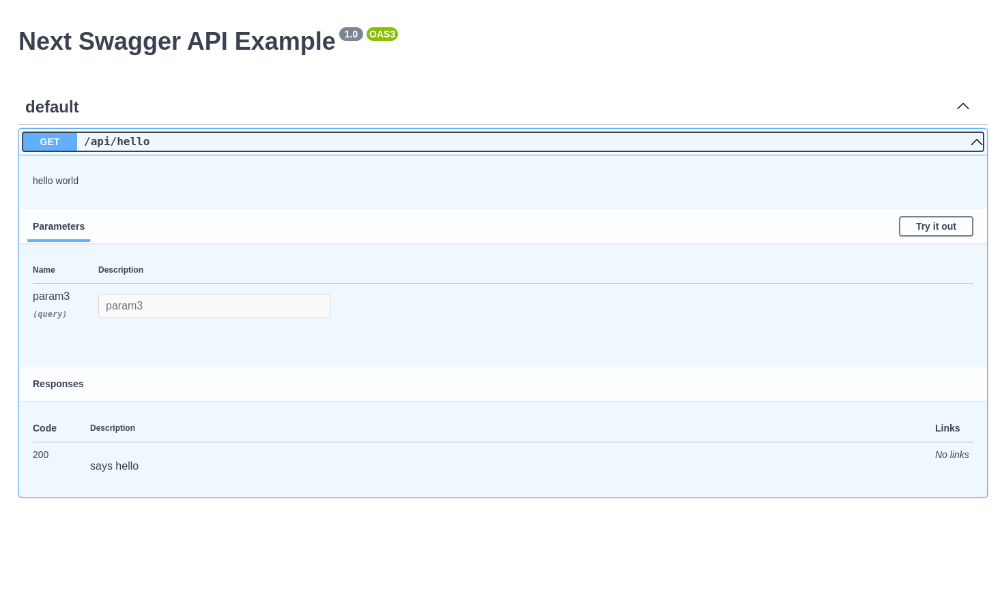

# swcminify-swagger-bug

This is a nextjs project demonstrating a bug in swcMinify that causes parameter arrays in OpenAPI documentation generated by `next-swagger-doc` / `swagger-jsdoc` to render only the last parameter in the array.

## Steps to reproduce

- `yarn install` to install dependencies
- When you run `yarn dev`, you should see all 3 params in the swagger documentation generated from the jsdoc in `pages/api/hello.ts`:

- However, when you create a production build with `yarn build` and run the production server with `yarn start`, all params but param3 are gone:

The root cause seems to be somewhere in swcMinify. Setting `swcMinify: false` in `next.config.js` and running `yarn build` and `yarn start` again results in the correct output.
